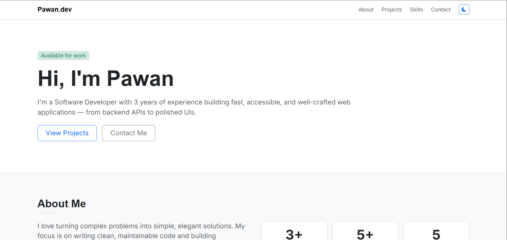
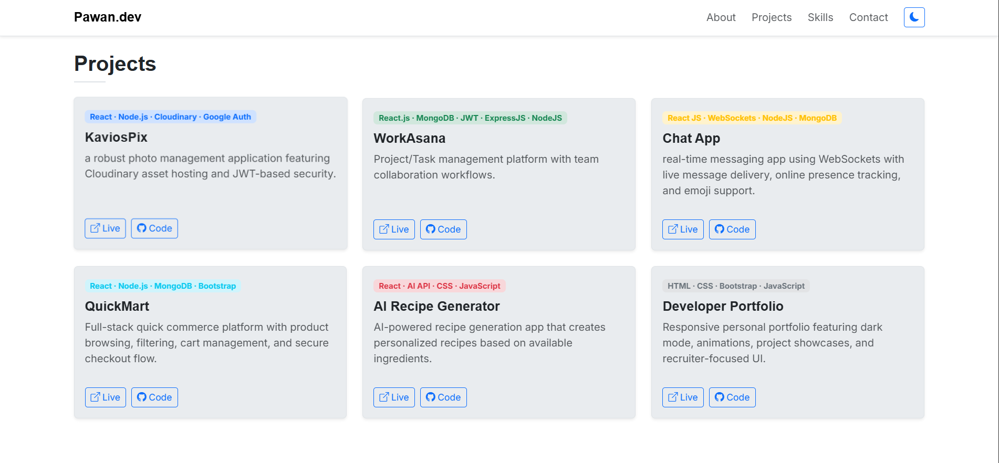
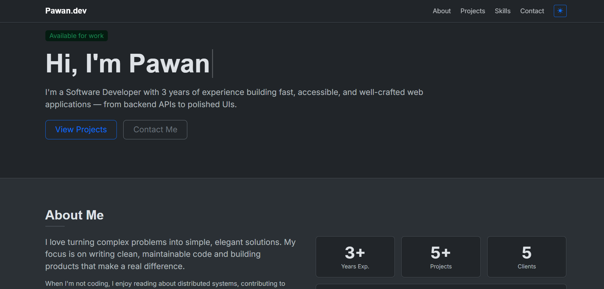

# Pawan.dev — Developer Portfolio

A modern, responsive personal portfolio website showcasing my full-stack development projects, technical skills, and professional experience.

Built with **HTML, CSS, Bootstrap 5, and JavaScript**, featuring dark mode support, smooth animations, and recruiter-focused project presentation.

---

## Live Demo

[View Portfolio](https://portfolio-pawanx.vercel.app/)

---

## Features

* Responsive design for all devices
* Dark / Light mode toggle
* Smooth scroll animations using AOS
* Interactive project showcase
* Modern UI with Bootstrap 5
* Contact section
* Animated typing effect
* Recruiter-focused layout
* Optimized project cards with live demo + source links

---

## Projects Showcased

### 1. WorkAsana

Project & task management platform with team collaboration workflows.

**Tech Stack:**
React.js · MongoDB · JWT · Express.js · Node.js

---

### 2. KaviosPix

Cloud-based photo management platform with secure asset hosting and authentication.

**Tech Stack:**
React · Node.js · Cloudinary · Google Auth

---

### 3. Chat App

Real-time messaging application with live communication features.

**Tech Stack:**
React.js · WebSockets · Node.js · MongoDB

---

### 4. QuickMart

Full-stack quick commerce platform with product filtering and cart workflows.

**Tech Stack:**
React · Node.js · MongoDB · Bootstrap

---

### 5. AI Recipe Generator

AI-powered recipe generation platform based on user ingredients.

**Tech Stack:**
React · AI API · JavaScript · CSS

---

### 6. Developer Portfolio

This portfolio itself.

**Tech Stack:**
HTML · CSS · Bootstrap · JavaScript

---

## Tech Stack

### Frontend

* HTML5
* CSS3
* JavaScript
* Bootstrap 5

### Libraries & Tools

* Bootstrap Icons
* AOS (Animate On Scroll)
* Google Fonts
* Vercel

---

## Folder Structure

```bash
portfolio/
│── index.html
│── styles.css
│── script.js
│── assets/
│   └── Resume Pawan Mishra.pdf
```

---

## Run Locally

Clone the repository:

```bash
git clone https://github.com/pawanx/portfolio-pawanx.git
```

Navigate to project directory:

```bash
cd portfolio-pawanx
```

Open:

```bash
index.html
```

Or run with VS Code Live Server.

---

## Screenshots





---

## Deployment

Deployed using **Vercel**

---

## Connect With Me

**GitHub**
https://github.com/pawanx

**LinkedIn**
https://linkedin.com/in/pawan-mishra-08b3b9133/

**Portfolio**
https://portfolio-pawanx.vercel.app/

---

## Author

**Pawan Mishra**

Software Developer focused on building scalable full-stack applications and polished user experiences.

---

⭐ If you like this project, consider giving it a star.
